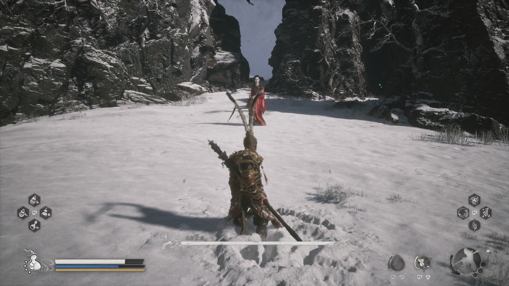
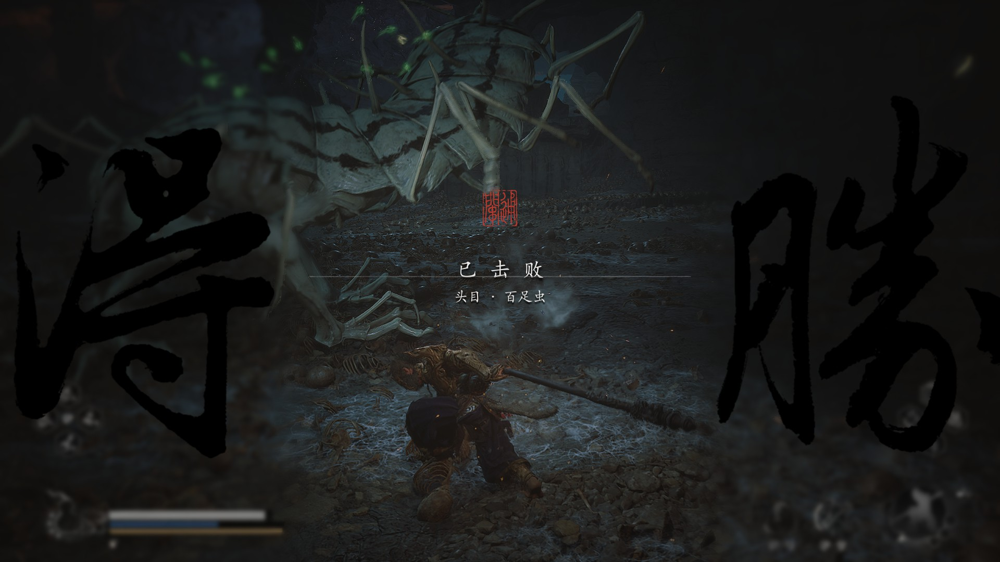
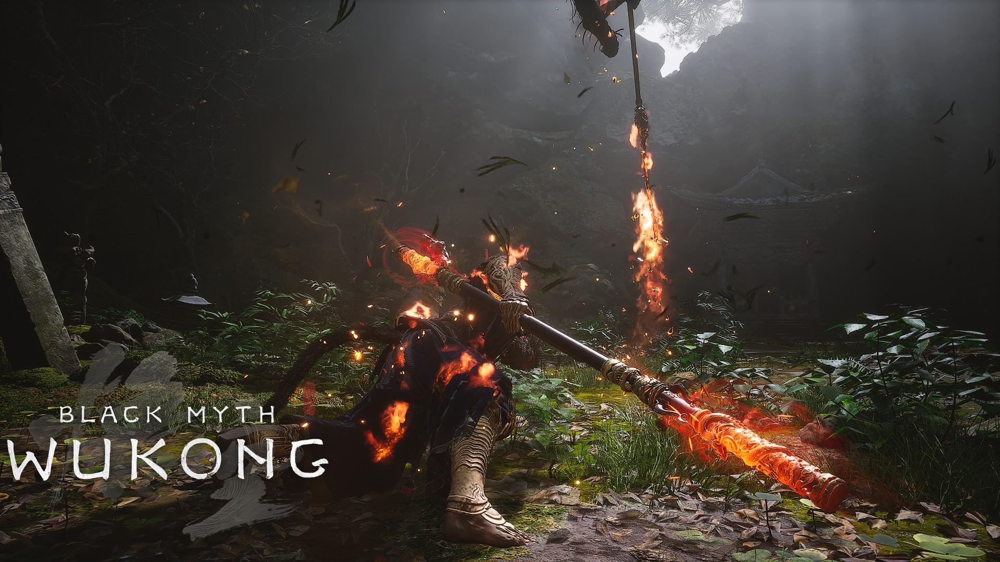
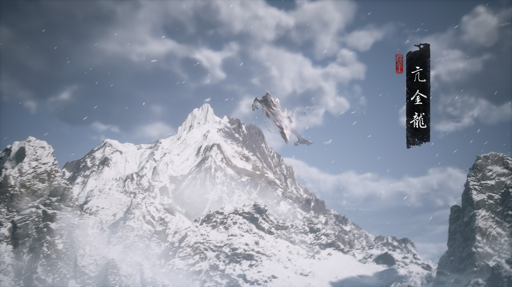

# 黑神话悟空游戏截图

把输入图、所选模式的实际游戏参考图和透明PNG素材一并交给图像生成/编辑模型，在一次生成中完成主体重绘、16:9构图和UI融合。不调用本地拼图脚本，不再把风格重绘与UI合成拆成两个独立处理任务。

## 交互入口

1. 没有输入图片时，只要求用户上传图片。
2. 用户未指定模式时，必须完整保留并列出四个选项，询问：`请选择：游玩界面、得胜界面、游戏截图、角色入场。`不得删除、合并、改名或跳过其中任何选项。
3. 用户已在同一请求中指定模式时，跳过模式询问。
4. 用户选择“游戏截图”且未说明是否需要人物时，继续询问：`游戏截图中是否置入人物？`
5. 用户选择“游玩界面”时不询问是否置入人物，必须自动从内置人物素材中选择并置入一名人物。
6. 用户选择“得胜界面”或“角色入场”时，禁止询问是否置入人物，也禁止使用人物素材库。
7. “得胜界面”和“角色入场”必须替换素材中的旧名称：
   - 用户给出名称时直接使用。
   - 用户未给出且主体身份可以明确概括时，拟定2—4字中文短名。
   - 主体含义不明确时，把名称问题与模式问题合并询问一次；不要猜测专有角色名。
8. 多张图片按原顺序逐张独立处理，不拼成组图；模式及“游戏截图是否置入人物”的选择未另行说明时沿用用户对这一批图片的选择。

## 四种模式参考

执行前用图像查看工具打开与所选模式对应的参考图和PNG素材，观察相对尺寸、位置、留白和层级。最终生图时必须同时传入对应参考图和PNG素材；PNG是界面构成依据，不得被忽略。

| 模式 | 实际游戏画面参考 | 顶层PNG素材 | 应用规则 |
|---|---|---|---|
| 游玩界面 |  | `assets/ui/play.png` | 必须置入一名悟空；操作HUD必须严格依照该PNG原样融合，不增删、不改画；只有原图中另有明确敌方主体时，才可按固定位置和尺寸在下方中部增加一条白色Boss血条，不添加其他Boss界面 |
| 得胜界面 |  | `assets/ui/victory.png` | 不置入人物；先压暗、轻微柔化并加暗角，再叠加得胜UI；保留“已击败”“头目·”，替换原Boss名 |
| 游戏截图 |  | `assets/ui/screenshot.png` | 先询问是否置入人物；选择“是”时按游玩参考图置入一名匹配人物；无论是否置入人物，都只叠加左下角BLACK MYTH WUKONG水印，不额外生成战斗HUD |
| 角色入场 |  | `assets/ui/entrance.png` | 不使用人物素材库；叠加右侧毛笔黑条与印章，替换原竖排角色名 |

## 人物素材库

执行“游玩界面”或需要置入人物的“游戏截图”前，先用图像查看工具打开下列五张透明PNG，结合场景透视、动作强度、光线与色彩选择一张。只能置入一名，不得混合多个素材或另行生成不同造型的悟空。

| 素材 | 主要姿态 | 优先匹配场景 |
|---|---|---|
| `assets/characters/wukong-2.png` | 红金重甲、低姿持棍、背向镜头 | 暖色火光、寺院遗迹、近距离对峙、压迫感较强的战斗场景 |
| `assets/characters/wukong-3.png` | 蓝袍站立、长棍竖持、背向镜头 | 静态探索、远眺、雪地、山谷、建筑入口等平稳场景 |
| `assets/characters/wukong-4.png` | 蓝袍向前奔跑、低机位背影 | 道路、长廊、山径、追逐、具有明显纵深和前进方向的场景 |
| `assets/characters/wukong-5.png` | 蓝袍下沉蓄势、横棍动作 | 横向构图、敌人位于前方、战斗即将爆发或需要强动作张力的场景 |
| `assets/characters/wukong-6.png` | 红金重甲站立、棍横置肩后 | 宏大风景、战前停驻、暖灰环境、需要稳定英雄背影的场景 |

## 固定工作流

步骤1为前述模式确认；选择“游戏截图”时，同时确认是否置入人物。随后严格执行以下步骤。

### 2. 识别主体并完成16:9取景

- 识别用户图片的主体类别、数量、脸部、动作、朝向、关键道具、主体间关系和不可裁切部位。
- 按最终1920×1080、16:9横图建立主体安全框；输入比例不符时做主体感知裁切或补足环境，不得拉伸。
- 尽量完整保留主体、头脸、手脚、动作、重要物件和人物关系。竖图允许缩小原主体并扩展左右场景。
- 预留人物固定落位区和UI安全区：画面主体横向范围X=40.5%—54.5%、纵向范围约Y=31%—83%内不要安排不可遮挡的关键细节；游玩界面的左右下角、游戏截图的左下角不要放置关键脸部或物件。

### 3. 根据模式决定并置入人物

- **游玩界面**：必须从人物素材库选择一张最匹配场景的悟空PNG并置入，不得省略。
- **游戏截图**：只有用户回答“是”时才选择并置入人物；回答“否”时不得自行生成人物、背影或角色剪影。
- **得胜界面、角色入场**：均不得读取、选择或置入任何人物素材；这两个模式直接跳过本步骤的其余人物规则。
- 选择人物时依次判断：场景是静态还是运动、纵深方向、战斗强度、环境冷暖色、光线方向以及人物武器是否会遮挡原主体。
- 人物背向镜头，固定放置在画面下方中央。以角色脚底中心作为定位锚点，锚点位于整张图片的X=49%、Y=83%。
- 角色从脚底到最高点的高度约占整张图片高度的51%，主体最高点约位于Y=31%；角色主体最大宽度约占图片宽度的14%，主体横向范围约为X=40.5%—54.5%。
- 长武器、外伸饰物及人物阴影不计入上述角色主体高度与宽度；它们可以超出主体横向范围，但不得遮挡关键脸部、原图主物件或UI。
- 不得为了避让原主体而左右移动、缩小或放大人物。应在上一步16:9裁切和场景重构时调整原图构图，为固定人物位置预留空间。
- 人物必须保留所选素材的盔甲、毛发、棍棒、背影轮廓和主要动作；只允许为适配透视做轻微姿态调整，不得换装、换武器或变成不同造型。
- 让人物真正落在地面：补充正确的接触阴影、投影、脚底遮挡、地面压痕或雪泥互动；根据场景统一人物的明暗、色温、雾气、景深、颗粒和边缘锐度，消除贴纸感、白边和悬浮感。
- 置入的悟空是玩家角色，不得把他识别成Boss。只有用户原图中另有一个明确独立的敌方人物、动物或生物主体时，游玩界面才可添加Boss血条；不得附加Boss名称、头像、等级、图标或装饰框。

### 4. 按黑神话美术风格直接生成最终画面

默认只调用一次图像生成/编辑工具，在同一次生成中完成裁切、人物置入、场景重绘和UI融合。详细画面判断见[美术风格规则](references/style-guide.md)。

无人物时同时传入三类参考：用户图片、所选模式实际游戏截图、对应UI PNG。需要人物时同时传入四类参考：

1. 用户上传图片：决定原主体、场景、动作和内容关系；
2. 选中的`assets/characters/wukong-*.png`：决定玩家人物造型、姿态、武器和背影轮廓；
3. 所选模式的`references/*-reference.jpg`：决定《黑神话：悟空》式光影、材质、镜头、人物尺度与界面布局；
4. 所选模式的`assets/ui/*.png`：决定最终UI的内容、相对位置、大小和层级。

通用生图硬约束：

- 保留用户原图主体及其核心关系，只做适应游戏世界的少量场景微调。
- 使用低曝光但暗部可读的深沉S形明暗、侧逆光或顶部斜光、冷暗低饱和环境和少量暖色焦点。
- 达到AAA级写实PBR精度，表现毛发、布料、金属磨损、石材风化、泥土、积雪和合理湿度。
- 近景清晰、中景可读、远景受雾气与空气透视影响；体积光和天气粒子必须有来源。
- 置入人物必须继承场景光源、透视、环境反射、雾气和景深，与原主体和地面形成可信遮挡关系。
- UI位于最上层。所有模式均应保持对应PNG中的相对位置、比例、图标形态和边缘留白，不增加第二套HUD。
- 游玩界面的`assets/ui/play.png`是冻结的游戏操作UI：必须严格依照素材原样置入，不能重新设计、临摹替代、增加或删除图标、移动任何组件、修改大小关系、改变按键符号、量表颜色、透明度或边缘留白。
- 游玩界面出现Boss血条时，只增加一条横向白色血条，并严格使用以下整图相对坐标：中心锚点X=50.6%、Y=84.5%；整体宽度37.7%、整体高度5.4%；整体主体范围X=31.7%—69.4%、Y=81.9%—87.2%；核心白色血槽范围X=35.6%—65.7%、Y=84.2%—85.5%。血条水平居中放置于画面下方，作为人物图层之上的独立前景层，不得改变人物或操作HUD。
- 游玩界面的层级顺序固定为：场景背景 → 悟空人物 → 可选白色Boss血条 → `assets/ui/play.png`操作HUD；Boss血条必须压在人物图层之上，操作HUD保持最上层。
- 最终画面必须为16:9横图，目标1920×1080，不得拉伸主体。

按模式追加提示：

- **游玩界面**：`必须使用选中的悟空人物素材，以第三人称背影视角固定置于画面下方中央：脚底中心锚点X=49%、Y=83%，角色主体高度约51%，最高点约Y=31%，主体最大宽度约14%，横向范围X=40.5%—54.5%；长武器、外伸饰物和阴影不计入主体尺寸。将assets/ui/play.png作为冻结的最上层操作UI，严格保持其中所有组件、图标、按键、量表、相对位置、大小、颜色、透明度和边缘留白，禁止重新创作或增加第二套HUD。插入的悟空是玩家，不是Boss。若原图没有独立敌方主体，不添加Boss条；若原图有明确独立敌方主体，只增加一条横向白色Boss血条：中心锚点X=50.6%、Y=84.5%，整体宽度37.7%、整体高度5.4%，整体主体范围X=31.7%—69.4%、Y=81.9%—87.2%，核心白色血槽范围X=35.6%—65.7%、Y=84.2%—85.5%；血条水平居中位于画面下方和人物图层之上，不添加Boss名称、头像、等级、图标、彩色填充或装饰框。`
- **游戏截图—置入人物**：`必须使用选中的悟空人物素材，以第三人称背影视角固定置于画面下方中央：脚底中心锚点X=49%、Y=83%，角色主体高度约51%，最高点约Y=31%，主体最大宽度约14%，横向范围X=40.5%—54.5%；长武器、外伸饰物和阴影不计入主体尺寸。只使用游戏截图PNG中的左下角BLACK MYTH WUKONG水印，不添加操作HUD、Boss条或其他标题。`
- **游戏截图—不置入人物**：`保留用户原图的主体与场景，不生成悟空、背影人物或角色剪影；只使用游戏截图PNG中的左下角BLACK MYTH WUKONG水印。`
- **得胜界面**：`禁止置入悟空或其他人物素材。背景整体压暗并轻微柔化，加入暗角；保留PNG中的“得胜”“已击败”“头目·”结构，将“百足虫”准确替换为“{名称}”，旧名称不得残留。`
- **角色入场**：`禁止读取或置入人物素材库中的悟空。使用PNG中的右侧毛笔黑条和红色印章，将“亢金龙”准确替换为竖排“{名称}”，旧名称不得残留。`

只有当结果存在单一、明显且可修复的人物融合或UI错误时，才允许基于上一张结果追加一次图像编辑；第二次只修正错误区域，不重绘其他内容。

### 5. 成品检查

逐项确认：

- 输出确为1920×1080 PNG，主体未被拉伸，关键部位完整。
- 主体身份、动作和原场景关系仍可辨认；只做了与游戏世界匹配的少量场景调整。
- 暗部仍能读出材质，光源明确，没有死黑、塑料质感或过度锐化。
- 游玩界面是否确实置入了一名匹配场景的悟空；游戏截图是否严格遵守用户对“是否置入人物”的回答。
- 人物脚底中心是否准确位于X=49%、Y=83%，主体最高点是否约为Y=31%，主体高度是否约占51%，最大宽度是否约占14%，主体横向范围是否约为X=40.5%—54.5%；测量时不计长武器、外伸饰物及阴影。
- 人物是否存在正确接触阴影、投影、透视、雾气与地面互动，没有白边、悬浮或贴纸感。
- 人物素材的造型、盔甲、武器、背影轮廓和主要动作是否保持一致，没有生成第二名悟空。
- 游玩操作UI是否严格等同于`assets/ui/play.png`：组件数量、图标、按键符号、量表、相对位置、大小关系、颜色、透明度和边缘留白均不得自行变化；没有第二套重复HUD。
- 得胜和角色入场模式中旧名称已完全消失，新名称准确可读，无乱码、错字或重复字。
- 游玩模式只在原图另有明确独立敌方主体时出现Boss条；不能把置入的玩家悟空当作Boss。Boss条是否仅为下方中部的横向白色血条，中心锚点是否为X=50.6%、Y=84.5%，整体宽度是否为37.7%、整体高度是否为5.4%，整体主体范围是否为X=31.7%—69.4%、Y=81.9%—87.2%，核心白色血槽范围是否为X=35.6%—65.7%、Y=84.2%—85.5%；血条必须位于人物图层之上且没有名称、头像、等级、彩色填充、图标或装饰框。
- UI没有遮住主体脸部、关键动作和重要物件。

如只存在一个明确可修复的问题，针对该问题修正一次并重新检查。完成后直接返回成品图，不输出冗长过程说明。

## 禁止事项

禁止删除、合并或改名“游玩界面、得胜界面、游戏截图、角色入场”四个选项。禁止在得胜界面和角色入场模式使用人物素材；禁止游玩界面缺少悟空人物；禁止在用户选择“不置入人物”的游戏截图中擅自添加人物。禁止忽略PNG参考、重画或改造游玩操作UI、移动组件、改变图标与按键、修改量表、生成第二套HUD。禁止把Boss血条做成彩色、粗框、带头像、等级、图标、名称或装饰的面板。禁止一次置入多名悟空、改变人物主要造型、让人物悬浮或呈现明显贴纸边缘。禁止保留“百足虫”或“亢金龙”旧名、输出乱码、添加无关标题或小地图。避免过度HDR、死黑暗部、全局橙青、蓝紫霓虹、塑料皮肤、镜面盔甲、全屏火焰粒子、无来源体积光、随机古建筑、随机妖怪、把用户原图主体替换成悟空、二次元、油画、水墨插画和海报排版。
